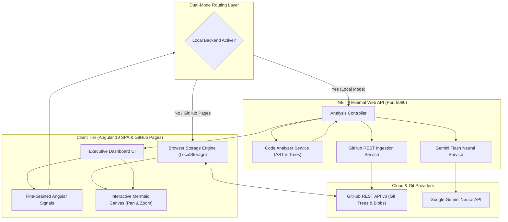
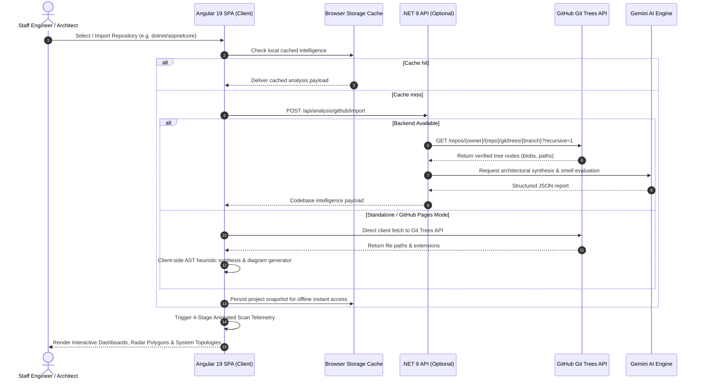

# CodePulse — Autonomous AI Codebase Intelligence & Architecture Telemetry Platform

[](https://zillerdx.github.io/ai-codebase-intelligence/)
[](https://dotnet.microsoft.com/)
[](https://angular.dev/)
[](https://ai.google.dev/)
[](https://developer.mozilla.org/)
[](LICENSE)

> **Live Interactive Preview**: [https://zillerdx.github.io/ai-codebase-intelligence/](https://zillerdx.github.io/ai-codebase-intelligence/)  
> Seamlessly analyze real codebases, explore system topologies with pan/zoom, simulate blast radii of pull requests, audit security vulnerabilities, and prioritize technical debt remediation directly in your browser.

---

## 1. Overview

**CodePulse** is an enterprise-grade Autonomous AI Codebase Intelligence and Architecture Telemetry Platform designed for engineering leaders, software architects, and senior developers. It bridges the gap between static AST compilation and large-scale generative AI reasoning.

### Key Capabilities
- **Real-Time Git Tree & AST Parsing**: Tokenizes repository trees, symbol definitions, call hierarchies, and architectural layers from live Git repositories (GitHub REST API v3) or local workspaces.
- **Dual-Mode Execution Architecture**:
  - **Local Enterprise Mode**: High-throughput C# .NET 9 Web API connected to Google Gemini Flash for deep neural semantic code analysis and AST graph synthesis.
  - **GitHub Pages Standalone Mode**: 100% serverless browser execution backed by Browser Storage (`localStorage`/IndexedDB) and direct client-side GitHub REST API integration.
- **Interactive Architecture & Flow Telemetry**: Dynamic Mermaid.js system topologies with multi-level zoom (0.5x – 3.5x), drag-to-pan canvas, and distraction-free Fullscreen Modal inspection.
- **AI Blast Radius & Regression Analysis**: Simulates the ripple effect of proposed code edits across microservices, shared domain aggregates, database models, and client SPAs before creating a PR.
- **Automated Technical Debt ROI Roadmap**: Categorizes smells, quantifies engineering debt scores, calculates developer remediation hours, and ranks refactoring targets by ROI.

---

## 2. System Architecture & Flow

### 2.1 System Topology & Ingestion Pipeline



### 2.2 Deep Scan & Analysis Sequence Flow



---

## 3. Project Directory Tree

```text
ai-codebase-intelligence/
├── .github/
│   └── workflows/
│       └── deploy-pages.yml             # Automated CI/CD deployment to GitHub Pages
├── .gitignore                           # Zero-leak exclusions (.NET, Node, secrets)
├── README.md                            # Architecture documentation and guide
│
├── backend/                             # .NET 9 Minimal Web API & Microservice Core
│   ├── CodebaseIntelligence.Api/
│   │   ├── Controllers/
│   │   │   └── AnalysisController.cs    # REST endpoints for summary, impact, docs, debt
│   │   ├── Models/
│   │   │   └── CodebaseAnalysisModels.cs# Strongly-typed C# domain records and DTOs
│   │   ├── Services/
│   │   │   ├── ICodeAnalyzerService.cs  # AST tokenizer and dependency matrix contract
│   │   │   ├── CodeAnalyzerService.cs   # Heuristic tree parser and complexity calculator
│   │   │   ├── IGeminiService.cs        # Gemini Flash AI integration contract
│   │   │   ├── GeminiService.cs         # Prompt engineering, JSON extraction & fallbacks
│   │   │   ├── IGitHubService.cs        # GitHub REST API interface
│   │   │   └── GitHubService.cs         # Recursive Git tree fetcher and language detector
│   │   ├── Properties/
│   │   │   └── launchSettings.json      # Local development port definitions (5080)
│   │   ├── Program.cs                   # .NET 9 Minimal API bootstrap & CORS policy
│   │   ├── CodebaseIntelligence.Api.csproj
│   │   ├── appsettings.json             # Git-tracked public configuration template
│   │   └── appsettings.local.json       # Git-ignored local secret store (Zero-Leak)
│   │
│   └── CodebaseIntelligence.Api.Tests/  # xUnit & Moq automated test suite
│       ├── AnalysisControllerTests.cs   # Controller integration tests
│       ├── CodeAnalyzerServiceTests.cs  # AST parsing & blast radius unit tests
│       └── CodebaseIntelligence.Api.Tests.csproj
│
└── frontend/                            # Modern Angular 19 SPA (Client Tier)
    └── codebase-intelligence-web/
        ├── public/
        │   ├── 404.html                 # SPA router fallback for GitHub Pages
        │   └── favicon.ico              # Platform favicon
        ├── src/
        │   ├── app/
        │   │   ├── models/
        │   │   │   └── codebase.models.ts  # TypeScript domain models and DTO interfaces
        │   │   ├── services/
        │   │   │   ├── api.service.ts      # Dual-mode API client with automatic fallback
        │   │   │   └── browser-storage.service.ts # LocalStorage cache & client GitHub scanner
        │   │   ├── app.config.ts        # Application bootstrap configuration
        │   │   ├── app.routes.ts        # Angular route definitions
        │   │   ├── app.html             # Single-file component template & modals
        │   │   ├── app.css              # Dark theme CSS tokens, grid layout, animations
        │   │   ├── app.ts               # Component controller with Angular Signals
        │   │   └── app.spec.ts          # Angular component unit tests
        │   ├── index.html               # SPA entry point with responsive viewport
        │   ├── main.ts                  # Angular standalone bootstrapping entry
        │   └── styles.css               # Global reset, typography, and scrollbar styling
        ├── angular.json                 # Angular CLI workspace configuration & budgets
        ├── package.json                 # Frontend dependencies & npm scripts
        └── tsconfig.json                # TypeScript compiler configuration
```

---

## 4. Key Functional Modules

| Module | Description | Interactive Capabilities |
| :--- | :--- | :--- |
| **Executive Summary Cockpit** | High-level PR velocity, review time saved, AI acceptance rates. | Interactive 3-point & 8-point SVG radar polygons, donut charts, timeframe filters (7D, 30D, 90D, ALL). |
| **Architecture Topology** | Distributed system component mapping, layer classification, tech stack. | Real-time Mermaid diagram, Inline Zoom (50% – 250%), Fullscreen pan-and-drag modal. |
| **AI Blast Radius & Impact** | Predictive regression analysis for hypothetical pull requests. | Target file selector, simulated diff input, cascading risk breakdown, dependency flow diagram. |
| **Code Smells & Security Radar** | Static security smell detection, anti-pattern identification. | Severity filter (Critical, Major, Minor), search bar, code snippets, remediation guidelines. |
| **Auto Documentation** | Reverse-engineered API endpoint specifications and Markdown export. | Endpoint payloads, auth requirements, sequence diagrams for asynchronous saga flows. |
| **Technical Debt Ledger** | Prioritized refactoring roadmap with developer ROI hours. | Overall debt score badge, remediation timeline, debt ratio gauge, sprint action plan. |
| **Git Repository Ingestion** | Import any public repository directly from GitHub or select curated templates. | Recursive Git tree discovery, auto language distribution, animated multi-stage scanning screen. |

---

## 5. Local Setup & Development Guide

### Prerequisites
- **.NET 9 SDK**: [Download .NET 9](https://dotnet.microsoft.com/download/dotnet/9.0)
- **Node.js**: `v20.x` or later ([Download Node.js](https://nodejs.org/))
- **Angular CLI**: Install globally via `npm install -g @angular/cli@19`

### Step 1: Clone Repository
```bash
git clone https://github.com/ZillerDX/ai-codebase-intelligence.git
cd ai-codebase-intelligence
```

### Step 2: Configure Secrets (Zero-Leak Policy)
To run with live Google Gemini AI capabilities locally:
1. Navigate to `backend/CodebaseIntelligence.Api`.
2. Create a local secrets configuration file named `appsettings.local.json` (this file is pre-configured in `.gitignore` to prevent leaks):
```json
{
  "Gemini": {
    "ApiKey": "YOUR_GEMINI_API_KEY"
  }
}
```

### Step 3: Run the .NET 9 Backend
```powershell
cd backend/CodebaseIntelligence.Api
dotnet restore
dotnet run
```
*The Web API will launch locally at `http://localhost:5080`.*

### Step 4: Run the Angular 19 Frontend
In a new terminal window:
```powershell
cd frontend/codebase-intelligence-web
npm install
npm start
```
*The frontend application will start at `http://localhost:4200` with instant Hot Module Replacement (HMR).*

### Step 5: Execute Automated Test Suites
```powershell
# Run backend tests (.NET 9)
cd backend/CodebaseIntelligence.Api.Tests
dotnet test --nologo -v q

# Run frontend tests (Angular / Vitest)
cd frontend/codebase-intelligence-web
npm test
```

---

## 6. Deployment to GitHub Pages

The repository includes an automated GitHub Actions workflow (`.github/workflows/deploy-pages.yml`). When commits are pushed to the `main` branch, the action builds the Angular application with `--base-href /ai-codebase-intelligence/` and deploys it directly to GitHub Pages.

To manually build the distribution:
```powershell
cd frontend/codebase-intelligence-web
npm run build:gh-pages
```
The output files will be emitted to `dist/codebase-intelligence-web/browser/`.

---

## 7. Zero-Leak Security Architecture

- **Server-Side API Proxying**: Public visitors on GitHub Pages or local browsers never receive direct exposure to AI API keys. All neural queries are securely proxied through the local .NET backend.
- **GitIgnore Isolation**: Sensitive configuration files (`appsettings.local.json`, `appsettings.Development.Local.json`, `.env*`) are strictly blocked from git tracking.
- **Client-Side Graceful Degradation**: When operating on static hosts (GitHub Pages) without a backend, CodePulse utilizes client-side AST heuristics and browser storage, preserving complete application functionality with zero key exposure.

---

## 8. License

This project is licensed under the [MIT License](LICENSE).
