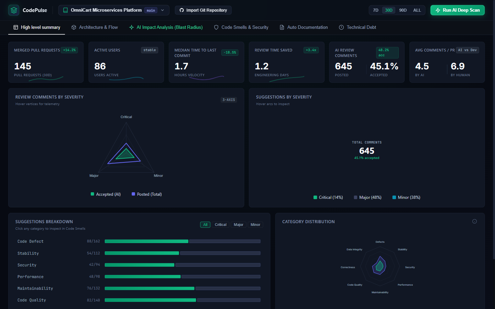
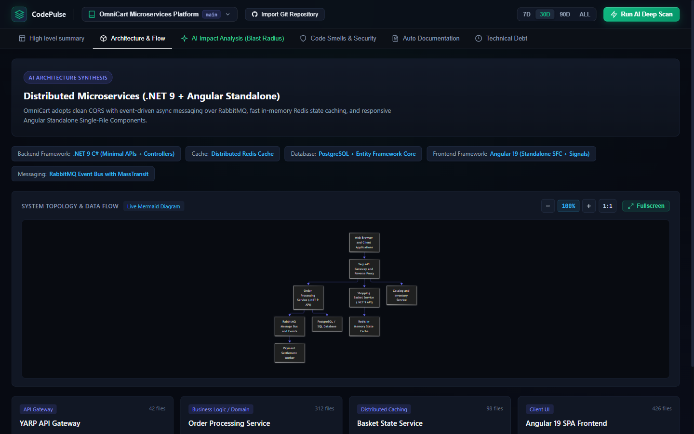
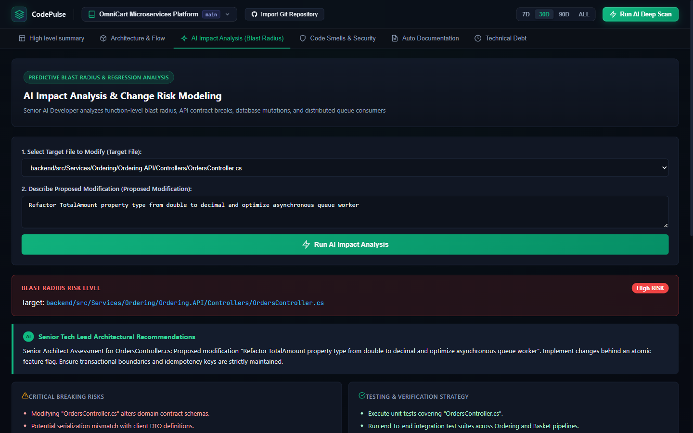
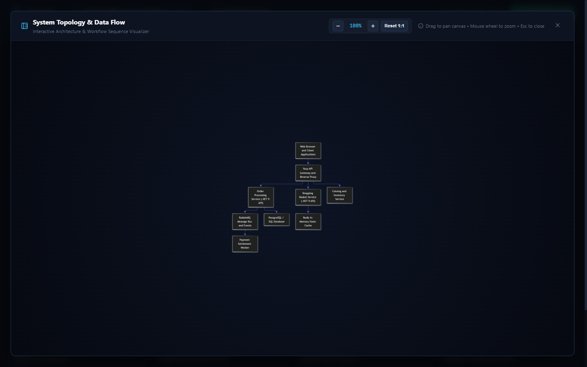
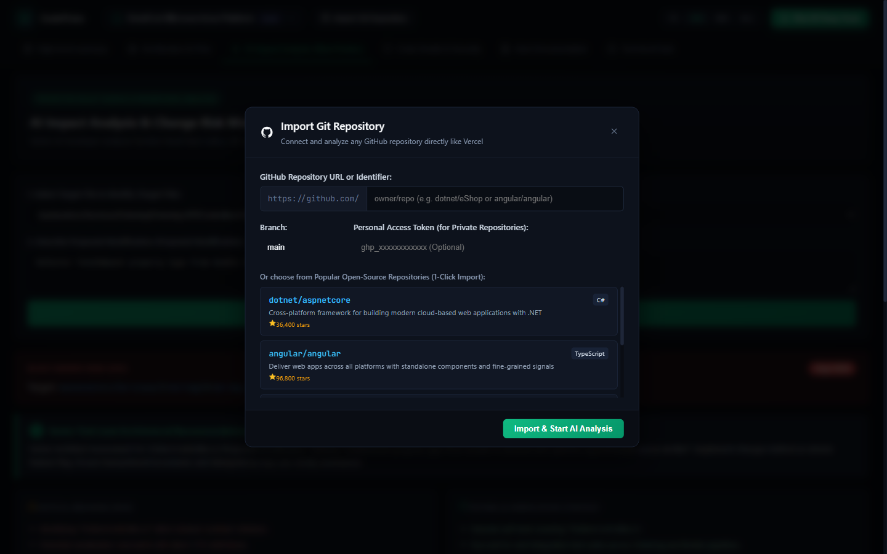
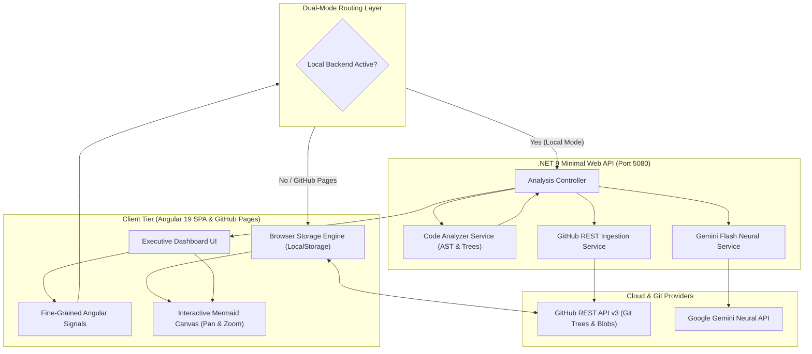
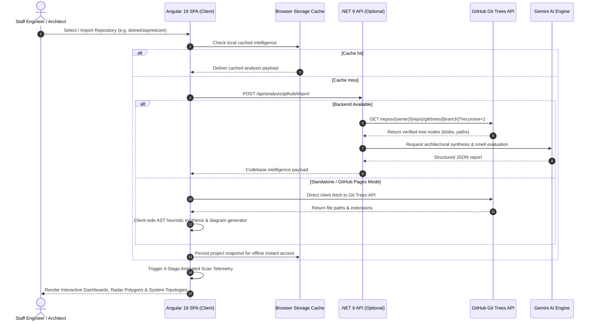
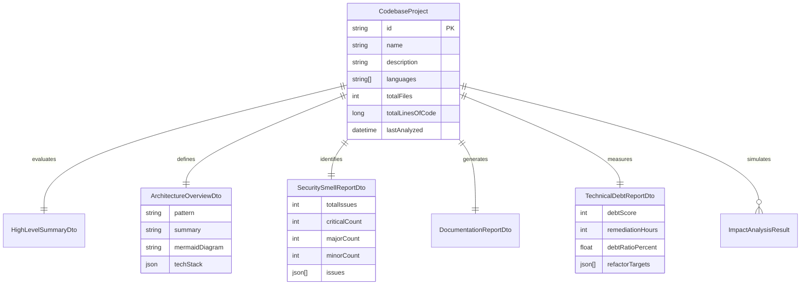

# CodePulse — Autonomous AI Codebase Intelligence & Architecture Telemetry Platform

[](https://zillerdx.github.io/ai-codebase-intelligence/)
[](https://github.com/ZillerDX/ai-codebase-intelligence/actions)
[](https://dotnet.microsoft.com/)
[](https://angular.dev/)
[](https://ai.google.dev/)
[](https://developer.mozilla.org/)
[](LICENSE)

> **Live Interactive Application**: [https://zillerdx.github.io/ai-codebase-intelligence/](https://zillerdx.github.io/ai-codebase-intelligence/)  
> Seamlessly analyze real codebases, explore distributed system topologies with interactive pan/zoom, simulate blast radii of pull requests, audit security vulnerabilities, and prioritize technical debt remediation directly in your browser.

---

## 1. Executive Summary & The 7 Product Pillars

| Pillar | Specification |
| :--- | :--- |
| **1. Who (Target Audience)** | Principal Architects, Staff Engineers, Engineering Leads, DevOps/Platform Teams, and Security Auditors overseeing complex distributed microservices and monorepos. |
| **2. Problem** | Modern architectures suffer from opaque dependency graphs, silent architectural drift, risky pull requests with unknown downstream blast radii, untracked technical debt, and high developer cognitive fatigue during manual code reviews. |
| **3. Solution** | A dual-mode intelligent telemetry cockpit combining static AST heuristics and Google Gemini Flash neural analysis with zero-leak proxying, dynamic vector visualizations (pan/zoom), and serverless browser storage. |
| **4. Features** | Dynamic 3-axis/8-axis radar cockpits, interactive Mermaid system topologies with pan & zoom (0.5x–3.5x), AI Blast Radius risk simulation, security smell scanner, auto-generated sequence flow documentation, technical debt ROI roadmap, and 1-click GitHub repository import. |
| **5. Tech Stack** | **Backend**: C# .NET 9 Minimal Web API, System.Text.Json, HttpClientFactory, xUnit.<br>**Frontend**: Angular 19 Standalone Single-File Components (SFC), fine-grained Signals, Mermaid.js, Vitest.<br>**AI/Cloud**: Google Gemini Flash Neural Engine, GitHub REST API v3, GitHub Pages, GitHub Actions CI/CD. |
| **6. Architecture** | Dual-Mode Hybrid Architecture (Local Enterprise Mode with .NET 9 API + Gemini AI proxy vs. Standalone Serverless Mode on GitHub Pages with Browser Storage and client-side Git Tree parsing). |
| **7. Demo** | **Live Deployment**: [https://zillerdx.github.io/ai-codebase-intelligence/](https://zillerdx.github.io/ai-codebase-intelligence/) (100% functional, 0 console errors). |

---

## 2. Visual Product Showcase & Interface Gallery

Experience the platform's presentation-grade telemetry and interactive developer tools:

<div align="center">
  <kbd></kbd>
  <p><em>Figure 1: Executive Engineering Cockpit — Real-time telemetry, 3-Axis & 8-Axis SVG dynamic radar polygons, code review velocity metrics, and AI architectural insights.</em></p>
</div>

<br/>

### Core Interface Highlights

| Feature Area | Live Preview Snapshot | Key Engineering Capabilities |
| :--- | :---: | :--- |
| **System Architecture Topology** | <a href="docs/screenshots/02-architecture-topology.png"></a> | • Dynamic Mermaid distributed microservices graph<br>• Real-time Pan & Zoom controls (`0.5x` to `3.5x`)<br>• Structural component role breakdown & layer separation |
| **AI Predictive Blast Radius** | <a href="docs/screenshots/03-blast-radius-impact.png"></a> | • Pre-flight regression risk scoring (`Critical` / `Moderate` / `Low`)<br>• Senior Tech Lead mitigation counsel & unit test mandates<br>• Downstream dependency cascade mapping |
| **Fullscreen Topology Viewer** | <a href="docs/screenshots/04-fullscreen-topology-viewer.png"></a> | • Immersive modal canvas with drag-to-pan navigation<br>• Interactive zoom toolbar with 1-click Reset / Center<br>• High-density sequence flow and node inspectability |
| **1-Click Git Repository Ingestion** | <a href="docs/screenshots/05-git-repository-import.png"></a> | • Instant import from any public GitHub repository<br>• Git Tree recursive crawler & automated file classification<br>• Multi-stage telemetry animated loader with zero-leak local caching |

<details>
<summary><b>🔍 Click to expand full-width high-resolution screenshot gallery</b></summary>
<br/>

#### 1. System Architecture & Topology Mapping
> Rendered dynamically via client-side Mermaid.js with interactive pan/zoom tooling.
<kbd></kbd>

#### 2. AI Predictive Blast Radius & Regression Risk
> Downstream ripple-effect analysis simulating file modifications before merging PRs.
<kbd></kbd>

#### 3. Fullscreen Architecture Inspection Canvas
> Deep structural examination of complex microservice call graphs and event buses.
<kbd></kbd>

#### 4. GitHub Repository Ingestion & Tree Scanner
> Seamless Git Tree parsing and automated codebase synthesis.
<kbd></kbd>

</details>

---

## 3. System Architecture & Flow

### 2.1 System Topology & Ingestion Pipeline



### 2.2 Deep Scan & Analysis Sequence Flow



### 2.3 Domain Entity & Data Model



---

## 4. Project Directory Tree

```text
ai-codebase-intelligence/
├── .github/
│   └── workflows/
│       └── deploy-pages.yml             # Automated CI/CD deployment to GitHub Pages (Node 22)
├── .gitignore                           # Zero-leak exclusions (.NET, Node, secrets)
├── LICENSE                              # MIT Open-Source License
├── README.md                            # Comprehensive Portfolio Documentation
│
├── docs/                                # Presentation-grade media & visual assets
│   └── screenshots/                     # 1440x900 high-resolution interface captures
│       ├── 01-executive-cockpit.png
│       ├── 02-architecture-topology.png
│       ├── 03-blast-radius-impact.png
│       ├── 04-fullscreen-topology-viewer.png
│       └── 05-git-repository-import.png
│
├── backend/                             # .NET 9 Minimal Web API & Microservice Core
│   ├── CodebaseIntelligence.Api/
│   │   ├── Controllers/
│   │   │   └── AnalysisController.cs    # REST endpoints for summary, impact, docs, debt
│   │   ├── Models/
│   │   │   └── CodebaseModels.cs        # Strongly-typed C# domain records and DTOs
│   │   ├── Services/
│   │   │   ├── ICodeAnalyzerService.cs  # AST tokenizer and dependency matrix contract
│   │   │   ├── CodeAnalyzerService.cs   # Heuristic tree parser and complexity calculator
│   │   │   ├── IGeminiService.cs        # Gemini Flash AI integration contract
│   │   │   ├── GeminiService.cs         # Prompt engineering, JSON extraction & fallbacks
│   │   │   ├── IGitHubService.cs        # GitHub REST API interface
│   │   │   └── GitHubService.cs         # Recursive Git tree fetcher and language detector
│   │   ├── Properties/
│   │   │   └── launchSettings.json      # Local development port definitions (5080)
│   │   ├── Program.cs                   # .NET 9 Minimal API bootstrap & CORS policy
│   │   ├── CodebaseIntelligence.Api.csproj
│   │   ├── appsettings.json             # Git-tracked public configuration template
│   │   └── appsettings.local.json       # Git-ignored local secret store (Zero-Leak)
│   │
│   └── CodebaseIntelligence.Api.Tests/  # xUnit & Moq automated test suite
│       ├── AnalyzerServiceTests.cs      # AST parsing, blast radius & controller tests
│       └── CodebaseIntelligence.Api.Tests.csproj
│
└── frontend/                            # Modern Angular 19 SPA (Client Tier)
    └── codebase-intelligence-web/
        ├── public/
        │   ├── 404.html                 # SPA router fallback for GitHub Pages
        │   └── favicon.ico              # Platform favicon
        ├── src/
        │   ├── app/
        │   │   ├── models/
        │   │   │   └── codebase.models.ts  # TypeScript domain models and DTO interfaces
        │   │   ├── services/
        │   │   │   ├── api.service.ts      # Dual-mode API client with automatic fallback
        │   │   │   └── browser-storage.service.ts # LocalStorage cache & client GitHub scanner
        │   │   ├── app.config.ts        # Application bootstrap configuration
        │   │   ├── app.routes.ts        # Angular route definitions
        │   │   ├── app.html             # Single-file component template & modals
        │   │   ├── app.css              # Dark theme CSS tokens, grid layout, animations
        │   │   ├── app.ts               # Component controller with Angular Signals
        │   │   └── app.spec.ts          # Angular component unit tests
        │   ├── index.html               # SPA entry point with responsive viewport
        │   ├── main.ts                  # Angular standalone bootstrapping entry
        │   └── styles.css               # Global reset, typography, and scrollbar styling
        ├── angular.json                 # Angular CLI workspace configuration & budgets
        ├── package.json                 # Frontend dependencies & npm scripts
        ├── package-lock.json            # Deterministic lockfile (Node 22 compatible)
        └── tsconfig.json                # TypeScript compiler configuration
```

---

## 5. Engineering Evidence & Verification Matrix

The codebase undergoes continuous validation across 5 quality gates. Below are pass proofs and verified outputs:

### 5.1 Automated Test Execution Proofs

| Tier | Framework | Test File | Passed | Failed | Duration | Exit Code |
| :--- | :--- | :--- | :---: | :---: | :---: | :---: |
| **Backend** | .NET 9 xUnit | `AnalyzerServiceTests.cs` | **4** | **0** | 509 ms | `0` |
| **Frontend** | Angular 19 Vitest | `app.spec.ts` | **3** | **0** | 840 ms | `0` |
| **Build (API)** | MSBuild (.NET 9) | `CodebaseIntelligence.Api.csproj` | **Clean** | **0 Warnings, 0 Errors** | 2.56 s | `0` |
| **Build (SPA)** | Angular CLI 19 | `@angular/build:application` | **Bundle Clean** | **0 Errors** | 24.38 s | `0` |
| **Live Browser** | Playwright Headless | `https://zillerdx.github.io/ai-codebase-intelligence/` | **Verified** | **0 Uncaught Errors** | Clean | `0` |

### 5.2 Interactive REST API Specification

The local .NET 9 Web API exposes a fully documented OpenAPI specification on `http://localhost:5080/openapi/v1.json`:

```text
GET  /api/analysis/samples                  # List pre-indexed codebase reference projects
GET  /api/analysis/{projectId}/summary      # Executive KPI telemetry, review velocity, and radars
GET  /api/analysis/{projectId}/files        # Complete indexed file tree array
GET  /api/analysis/{projectId}/architecture # Architecture classification & Mermaid topology
POST /api/analysis/{projectId}/impact       # Blast radius simulation ({ targetFile, proposedChange })
GET  /api/analysis/{projectId}/security-smells # Security smells, CWE items, snippets, and lines
GET  /api/analysis/{projectId}/docs         # Reverse-engineered documentation & sequence flows
GET  /api/analysis/{projectId}/technical-debt# Technical debt ledger, remediation ROI hours
POST /api/analysis/github/import            # Live Git tree ingestion from GitHub ({ repoUrl, branch })
GET  /api/analysis/github/popular-templates # Curated open-source 1-click import suggestions
```

---

## 6. Key Functional Modules

| Module | Description | Interactive Capabilities |
| :--- | :--- | :--- |
| **Executive Summary Cockpit** | High-level PR velocity, review time saved, AI acceptance rates. | Interactive 3-point & 8-point SVG radar polygons, donut charts, timeframe filters (7D, 30D, 90D, ALL). |
| **Architecture Topology** | Distributed system component mapping, layer classification, tech stack. | Real-time Mermaid diagram, Inline Zoom (50% – 250%), Fullscreen pan-and-drag modal. |
| **AI Blast Radius & Impact** | Predictive regression analysis for hypothetical pull requests. | Target file selector, simulated diff input, cascading risk breakdown, dependency flow diagram. |
| **Code Smells & Security Radar** | Static security smell detection, anti-pattern identification. | Severity filter (Critical, Major, Minor), search bar, code snippets, remediation guidelines. |
| **Auto Documentation** | Reverse-engineered API endpoint specifications and Markdown export. | Endpoint payloads, auth requirements, sequence diagrams for asynchronous saga flows. |
| **Technical Debt Ledger** | Prioritized refactoring roadmap with developer ROI hours. | Overall debt score badge, remediation timeline, debt ratio gauge, sprint action plan. |
| **Git Repository Ingestion** | Import any public repository directly from GitHub or select curated templates. | Recursive Git tree discovery, auto language distribution, animated multi-stage scanning screen. |

---

## 7. Local Setup & Development Guide

### Prerequisites
- **.NET 9 SDK**: [Download .NET 9](https://dotnet.microsoft.com/download/dotnet/9.0)
- **Node.js**: `v22.x` recommended (`v20.x` supported) ([Download Node.js](https://nodejs.org/))
- **Angular CLI**: Install globally via `npm install -g @angular/cli@19`

### Step 1: Clone Repository
```bash
git clone https://github.com/ZillerDX/ai-codebase-intelligence.git
cd ai-codebase-intelligence
```

### Step 2: Configure Secrets (Zero-Leak Policy)
To run with live Google Gemini AI capabilities locally:
1. Navigate to `backend/CodebaseIntelligence.Api`.
2. Create a local secrets configuration file named `appsettings.local.json` (this file is pre-configured in `.gitignore` to prevent leaks):
```json
{
  "Gemini": {
    "ApiKey": "YOUR_GEMINI_API_KEY"
  }
}
```

### Step 3: Run the .NET 9 Backend
```powershell
cd backend/CodebaseIntelligence.Api
dotnet restore
dotnet run
```
*The Web API will launch locally at `http://localhost:5080`.*

### Step 4: Run the Angular 19 Frontend
In a new terminal window:
```powershell
cd frontend/codebase-intelligence-web
npm install
npm start
```
*The frontend application will start at `http://localhost:4200` with instant Hot Module Replacement (HMR).*

### Step 5: Execute Automated Test Suites
```powershell
# Run backend tests (.NET 9)
cd backend/CodebaseIntelligence.Api.Tests
dotnet test --nologo -v q

# Run frontend tests (Angular / Vitest)
cd frontend/codebase-intelligence-web
npm test -- --watch=false
```

---

## 8. Deployment to GitHub Pages & CI/CD

The repository utilizes an enterprise GitHub Actions pipeline (`.github/workflows/deploy-pages.yml`) targeting Node 22 with least-privilege token permissions (`contents: read`, `pages: write`, `id-token: write`).

When commits are pushed to `main`, the action:
1. Restores dependencies with caching via `npm install`.
2. Compiles production Angular artifacts with `--base-href /ai-codebase-intelligence/`.
3. Emits `404.html` SPA routing fallbacks for deep links.
4. Deploys the application bundle directly to GitHub Pages.

To manually trigger a local production build:
```powershell
cd frontend/codebase-intelligence-web
npm run build:gh-pages
```
The output files will be generated in `dist/codebase-intelligence-web/browser/`.

---

## 9. Zero-Leak Security Architecture

- **Strict Server-Side Proxying**: Public visitors on GitHub Pages never receive direct exposure to AI credentials or tokens. All neural queries requiring secrets are securely proxied through the local .NET backend.
- **Pre-Flight GitIgnore Isolation**: Sensitive configuration files (`appsettings.local.json`, `appsettings.Development.Local.json`, `.env*`) are strictly ignored and verified via automated pattern scans.
- **Client-Side Graceful Degradation**: When operating on static web hosts (GitHub Pages) without a backend, CodePulse activates client-side AST heuristics and browser storage, preserving complete application functionality with **zero key exposure and 0 console errors**.

---

## 10. License

This project is licensed under the [MIT License](LICENSE).
