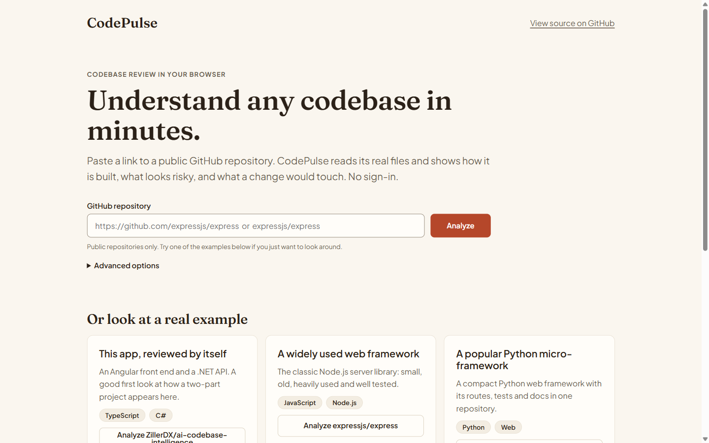
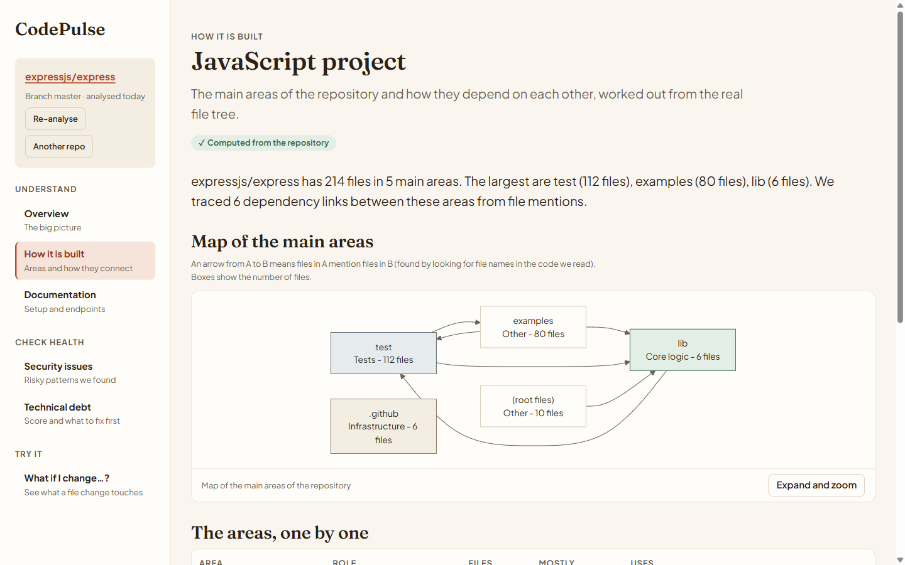
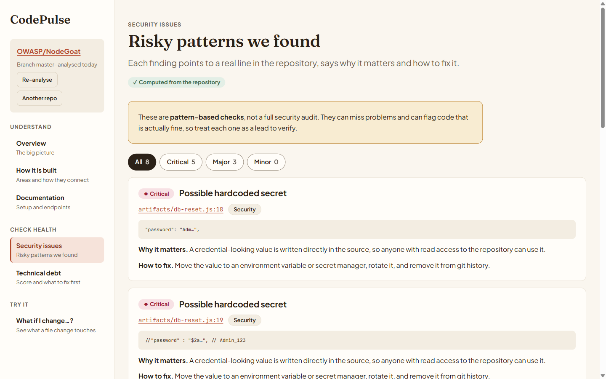
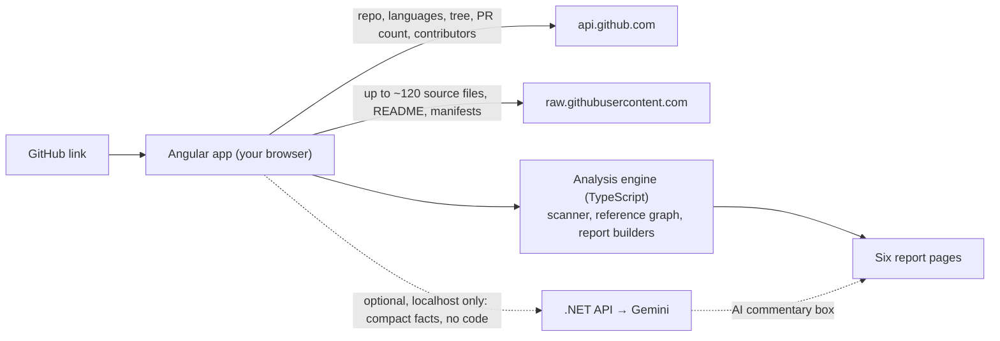

# CodePulse — review any public GitHub repository in your browser

Paste a link to a public GitHub repository and CodePulse reads its real files, then shows how it is built, what looks risky, how healthy the code is, and what a change to one file would touch. No sign-in. Everything runs in your browser; an optional local backend adds AI commentary.

[](https://github.com/ZillerDX/ai-codebase-intelligence/actions/workflows/backend-ci.yml)
[](https://github.com/ZillerDX/ai-codebase-intelligence/actions/workflows/frontend-ci.yml)
  

**Live app:** https://codepulse.jodnoi.workers.dev (hosted on Cloudflare). Deployment: [docs/DEPLOY.md](docs/DEPLOY.md).

<p align="center"></p>

## What you get

| Page | What it shows | Where the data comes from |
| :-- | :-- | :-- |
| **Overview** | Key takeaway, stars, contributors, merged PRs, lines of code, language mix, findings by severity | GitHub API (metadata, languages, PR search, contributors) and the files we read |
| **How it is built** | Main areas, their role, which area uses which, a diagram, tech stack | The real file tree plus a name-based reference graph |
| **Documentation** | README summary, run commands, detected web endpoints with `file:line` links | README, `package.json` / project files, route patterns in the code |
| **Security issues** | Findings with file, line, snippet, why it matters and how to fix it | Rule-based scan of the files we read |
| **Technical debt** | A 0–100 score with the formula shown, files to fix first, order of work | Findings, large files, TODO density, tests and CI presence |
| **What if I change…?** | Files and tests that mention a chosen file, a risk level, a diagram | The reference graph |

<p align="center"> </p>

## How it works


```mermaid
flowchart LR
  Link["GitHub link"] --> Browser["Angular app (your browser)"]
  Browser -->|repo, languages, tree, PR count, contributors| API["api.github.com"]
  Browser -->|up to ~120 source files, README, manifests| Raw["raw.githubusercontent.com"]
  Browser --> Engine["Analysis engine (TypeScript)\nscanner, reference graph, report builders"]
  Engine --> Pages["Six report pages"]
  Browser -. "optional, localhost only: compact facts, no code" .-> Backend[".NET API → Gemini"]
  Backend -. "AI commentary box" .-> Pages
```

- **One analysis engine, in the browser** (`frontend/.../src/app/core`). It works the same on the hosted site and on localhost. File contents never leave your browser; they are scanned and discarded, and only derived facts are cached in `localStorage` for six hours.
- **The backend is optional.** With a Gemini key it adds an "AI commentary" box (`POST /api/analysis/ai/narrative`). It receives compact, size-bounded facts, never code, and its answer is shown separately and labelled. Without a key, or on the hosted site, the box is simply absent.
- **Nothing is invented.** Numbers come from GitHub or from the files we read. Anything estimated is marked (for example "≈" on lines of code when we did not read every file).

## Limits you should know

- **Public repositories only.**
- **GitHub rate limit:** anonymous use allows 60 API requests per hour per IP; one analysis uses about five. File contents come from `raw.githubusercontent.com`, which is not counted. An optional token (Advanced options) raises the API limit; it stays in memory and is sent only to `api.github.com`.
- **Sampling:** we read up to about 120 of the most relevant source files (files over 150 KB are skipped). Larger repositories are sampled, and every page says how many files it is based on.
- **Pattern rules, not an audit.** Findings can miss problems and can flag harmless code (for example a sample string that looks like a secret). They are leads to verify.
- **"What if" traces by file name**, so dynamic imports and name clashes can be missed. Very generic names (`index`, `main`) are reported as untraceable instead of guessed.

Rules today: hardcoded secrets (values are redacted in the report), SQL built from strings, `eval` / `new Function`, unsafe HTML injection, disabled TLS verification, weak hashes (MD5/SHA-1), wildcard CORS, swallowed errors, very large files.

## Run it locally

Requirements: Node 22.22.3+ or 24.15+, .NET 10 SDK (backend only).

```bash
# frontend (works on its own)
cd frontend/codebase-intelligence-web
npm install
npm start                       # http://localhost:4200

# optional AI commentary
cd backend/CodebaseIntelligence.Api
# put your key in appsettings.local.json (git-ignored):  { "Gemini": { "ApiKey": "..." } }
# or set the GEMINI_API_KEY environment variable
dotnet run                      # http://localhost:5080
```

Tests and checks:

```bash
cd frontend/codebase-intelligence-web && npm test -- --watch=false && node scripts/check-contrast.mjs
cd backend && dotnet test CodebaseIntelligence.Api.Tests
cd frontend/codebase-intelligence-web && npm run build   # production build
```

## Project layout

```text
frontend/codebase-intelligence-web/
  src/tokens.css            design tokens (colours, fonts, spacing) in one file
  src/styles.css            global styles
  src/app/core/             analysis engine: github-client, scanner, analyzer, reports, services
  src/app/shell/            sidebar layout, progress and error states
  src/app/pages/            welcome + six report pages
  src/app/ui/               shared components (badges, bars, diagram viewer, AI box)
  scripts/check-contrast.mjs  WCAG contrast check for the colour tokens
backend/
  CodebaseIntelligence.Api/        .NET 10 API (AI narrative + status endpoints, legacy endpoints)
  CodebaseIntelligence.Api.Tests/  xUnit tests
docs/DEPLOY.md             Cloudflare deployment
docs/superpowers/specs/     design spec for the redesign
```

Routing uses hash URLs (`/#/r/owner/repo/overview`) so deep links and refresh work on any static host without redirect rules.

## Design

"Warm Editorial": paper background, one terracotta accent used only for interactive elements, severity colours kept separate, Fraunces for headings, Plus Jakarta Sans for text and JetBrains Mono for code (self-hosted with `@fontsource`). Colour pairs are checked against WCAG AA by `scripts/check-contrast.mjs`, severity and result source are never conveyed by colour alone, and the whole app works with the keyboard.

## Known leftovers

The older canned-data endpoints in the .NET API (`/api/analysis/{id}/summary` and friends) are no longer used by the UI and are candidates for removal.

## License

MIT
