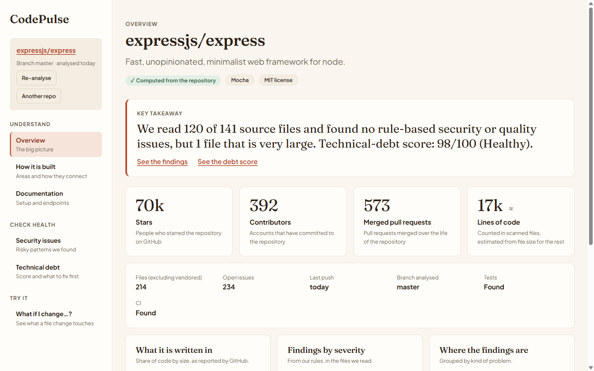
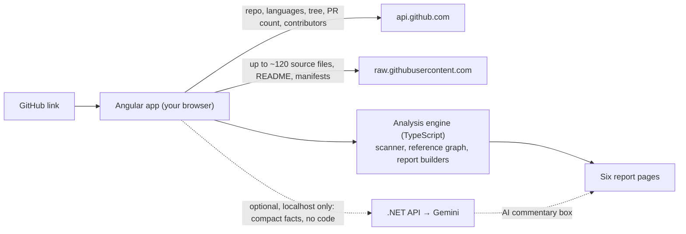

# CodePulse — review any public GitHub repository in your browser

Paste a link to a public GitHub repository and CodePulse reads its real files, then shows how it is built, what looks risky, how healthy the code is, and what a change to one file would touch. No sign-in. The analysis runs in your browser; an optional local backend adds AI commentary.

[](https://github.com/ZillerDX/ai-codebase-intelligence/actions/workflows/backend-ci.yml)
[](https://github.com/ZillerDX/ai-codebase-intelligence/actions/workflows/frontend-ci.yml)
  

**Live app:** https://codepulse-9dl.pages.dev (Cloudflare Pages, Git integration on `main`). Setup and troubleshooting: [docs/DEPLOY.md](docs/DEPLOY.md).

<p align="center"></p>

**Contents:** [Try it](#try-it) · [What you get](#what-you-get) · [How it works](#how-it-works) · [How the numbers are calculated](#how-the-numbers-are-calculated) · [Limits](#limits-you-should-know) · [Privacy](#privacy-and-security) · [Run locally](#run-it-locally) · [Backend API](#backend-api-optional) · [Deploy and CI](#deploy-and-ci) · [Project layout](#project-layout) · [Troubleshooting](#troubleshooting) · [License](#license)

## Try it

1. Open the live app, paste a link such as `https://github.com/expressjs/express` (or just `expressjs/express`), and press **Analyze**. Or click one of the three real examples on the welcome page.
2. Wait 10–30 seconds while the four steps run: repository details, file tree, source files, scan.
3. Start at **Overview**, then use the sidebar: **How it is built**, **Documentation**, **Security issues**, **Technical debt**, **What if I change…?**
4. Every page has its own link (`/#/r/owner/repo/security`), so you can share or reload it. Results are cached in your browser for six hours; **Re-analyse** fetches fresh data.

Under **Advanced options** you can pick a branch and add a GitHub token to raise the rate limit (see [Limits](#limits-you-should-know)).

## What you get

| Page | What it shows | Where the data comes from |
| :-- | :-- | :-- |
| **Welcome** | Link field, three real example repositories, recently analysed repositories | Your browser's local storage |
| **Overview** | Key takeaway, stars, contributors, merged PRs, lines of code, language mix, findings by severity and by category | GitHub API (metadata, languages, PR search, contributors) and the files we read |
| **How it is built** | Main areas, their role, which area uses which, a diagram you can expand and zoom, tech stack | The real file tree plus a name-based reference graph |
| **Documentation** | README summary, run commands, detected web endpoints with `file:line` links, where things live | README, `package.json` and project files, route patterns in the code |
| **Security issues** | Findings with file, line, snippet, why it matters and how to fix it, filterable by severity | Rule-based scan of the files we read |
| **Technical debt** | A 0–100 score with the formula shown, files to fix first, suggested order of work | Findings, large files, TODO density, tests and CI presence |
| **What if I change…?** | Files and tests that mention a chosen file, a risk level, a diagram of the ripple | The reference graph |
| **AI commentary** (optional) | A separate, labelled box on four pages | The optional backend, from compact facts only |

<p align="center"> </p>
<p align="center"></p>

## How it works


```mermaid
flowchart LR
  Link["GitHub link"] --> Browser["Angular app (your browser)"]
  Browser -->|repo, languages, tree, PR count, contributors| API["api.github.com"]
  Browser -->|up to ~120 source files, README, manifests| Raw["raw.githubusercontent.com"]
  Browser --> Engine["Analysis engine (TypeScript)\nscanner, reference graph, report builders"]
  Engine --> Pages["Six report pages"]
  Browser -. "optional, localhost only: compact facts, no code" .-> Backend[".NET API → Gemini"]
  Backend -. "AI commentary box" .-> Pages
```

1. **Read.** The browser asks GitHub for the repository details, languages, the full file tree (with sizes), the merged pull request count and the contributor count. It then downloads the README, build manifests and up to about 120 of the most relevant source files from `raw.githubusercontent.com`.
2. **Scan.** A TypeScript engine (`frontend/.../src/app/core`) counts lines, applies the rules, detects web endpoints and frameworks, and builds a *reference graph*: which files mention which other files.
3. **Report.** Each page is a pure function of those facts, so the same input always gives the same page. Nothing is invented: numbers come from GitHub or from the files we read, and anything estimated is marked (for example "≈" on lines of code when we did not read every file).
4. **Optional AI.** With the local backend and a Gemini key, four pages (architecture, documentation, debt, what-if) add a separate "AI commentary" box. The facts always come first and the AI text never replaces them.

**Which files are read.** Source files are ranked by how central they look (shallow paths, `src/`, `app/`, `lib/`, services and controllers rank higher, tests lower, larger files slightly higher). The top ~120 are read; files over 150 KB are skipped and counted. Vendored and build folders (`node_modules`, `dist`, `bin`, …) and binaries are ignored. Every page says how many files it is based on.

**Scan rules today:** hardcoded secrets (values are redacted in the report), SQL built from strings, `eval` / `new Function`, unsafe HTML injection, disabled TLS verification, weak hashes (MD5/SHA-1), wildcard CORS, swallowed errors, and very large files (over 800 lines). TODO/FIXME comments are counted for the debt score. Rules skip tests and docs where they would only add noise.

**Detected endpoints:** Express-style routers, NestJS, ASP.NET (controllers and minimal APIs), Flask/FastAPI, Spring, and Go `HandleFunc` / gin / echo style routes.

## How the numbers are calculated

**Technical-debt score** starts at 100 and loses points (higher is healthier). The Debt page shows this table with your repository's real values:

| Factor | Points lost |
| :-- | :-- |
| Critical findings | 5 each, max 30 |
| Major findings | 2 each, max 20 |
| Minor findings | 0.5 each, max 10 |
| Large files (over 800 lines) | 2 each, max 15 |
| TODO / FIXME density | per 1,000 scanned lines, max 10 |
| No automated tests found | 15 |
| No CI configuration found | 5 |

Grades: 80+ Healthy, 60–79 Fair, 40–59 Needs attention, below 40 At risk. The effort estimate (2 h per critical, 1 h per major, 15 min per minor, 4 h per large file) is a rough guide, not a promise.

**Lines of code** are counted exactly when every source file was read. Otherwise they are the scanned lines plus an estimate for the rest, calibrated from the bytes-per-line of the files we did read, and marked "≈".

**What-if risk** counts the non-test files that mention the chosen file by name: 0 is low, 1–3 medium, 4–10 high, more than 10 very high. Files that look like entry points or shared configuration (by name) are raised one level. Names too generic to trace (`index`, `main`, `app`, `config`, `utils`, …) or shared by several files are reported as *cannot tell* instead of guessed. Plain-word file names only count when they appear in an import path, so the word "error" in a comment does not link to `error.js`.

## Limits you should know

- **Public repositories only.**
- **GitHub rate limit:** anonymous use allows 60 API requests per hour per IP, and one analysis uses about five. File contents come from `raw.githubusercontent.com`, which is not counted. An optional token raises the API limit; it stays in memory and is sent only to `api.github.com`.
- **Sampling:** large repositories are sampled (see above), and every page says so.
- **Pattern rules, not an audit.** Findings can miss problems and can flag harmless code, for example a sample string that looks like a secret. Treat them as leads to verify.
- **"What if" traces by file name**, so dynamic imports and name clashes can be missed.
- **AI commentary** only appears when the frontend runs on `localhost` and the backend is running with a Gemini key. On the hosted site it is absent by design.

## Privacy and security

- Your browser talks to `api.github.com` and `raw.githubusercontent.com`. The app itself calls nothing else on the hosted site: it loads no analytics or tracking scripts and has no CodePulse server. (The hosting provider keeps its usual request logs.)
- File contents are scanned in memory and discarded. Only derived facts (counts, paths, findings with a short redacted snippet, the reference graph) are kept in `localStorage` for six hours. Your token is never stored.
- Secret-looking values are shortened in the report so it never reproduces a live credential.
- With the optional backend, the browser sends only compact facts (repository name, file paths, finding titles, scores), never file contents, and the backend validates and size-bounds the request. The model is told to treat the facts as data, and its output is length-limited and shown as plain text.
- Diagrams are rendered with Mermaid in `strict` security mode; the app sets security headers on the hosted site (`public/_headers`). A Content Security Policy is not set yet.

## Run it locally

Requirements: Node 24.15.0 (the version in `frontend/codebase-intelligence-web/.node-version`; Angular 22 needs 24.15+ or 22.22.3+) and, for the backend only, the .NET 10 SDK.

```bash
# frontend (works on its own)
cd frontend/codebase-intelligence-web
npm ci
npm start                       # http://localhost:4200

# optional AI commentary
cd backend/CodebaseIntelligence.Api
# put your key in appsettings.local.json (git-ignored):  { "Gemini": { "ApiKey": "..." } }
# or set the GEMINI_API_KEY environment variable
dotnet run                      # http://localhost:5080
```

Tests and checks:

```bash
cd frontend/codebase-intelligence-web
npm test -- --watch=false       # unit and component tests (Vitest)
node scripts/check-contrast.mjs # WCAG contrast of the colour tokens
npm run build                   # production build

cd backend
dotnet test CodebaseIntelligence.Api.Tests
```

To run one frontend spec folder: `npx ng test --watch=false --include "src/app/core/**/*.spec.ts"`. Tests never call the network: `src/app/core/testing/fake-github.ts` serves a fake repository to the analyzer.

## Backend API (optional)

The backend only adds AI commentary. It listens on `http://localhost:5080` and its CORS policy allows `http://localhost:4200` and `http://127.0.0.1:4200`.

| Endpoint | Purpose |
| :-- | :-- |
| `GET /api/analysis/ai/status` | `{ "configured": true/false }`: whether a Gemini key is present, so the UI knows to offer commentary |
| `POST /api/analysis/ai/narrative` | Body: `kind` (`architecture`, `docs`, `debt` or `impact`) plus compact facts (repo summary, up to 10 areas, 20 findings, 25 endpoints, debt score, and for `impact` the target, dependents and tests). Returns `{ source, headline, paragraphs, bullets }`, where `source` is `ai` or `fallback` (the UI ignores `fallback`) |

The request is validated (known kinds, field and list limits, 64 KB body limit), the prompt contains only the provided facts and tells the model to ignore instructions inside them, and the model's answer is parsed and length-bounded. Configuration keys: `Gemini:ApiKey` (or the `GEMINI_API_KEY` environment variable) and optionally `Gemini:Model`. Never commit a key; `appsettings.local.json` is git-ignored.

The older `/api/analysis/{projectId}/…` endpoints (summary, files, architecture, impact, security-smells, docs, technical-debt, `github/import`, `github/popular-templates`, `upload`) return canned or server-side-registered data. The UI no longer uses them; they are kept for now and are candidates for removal.

## Deploy and CI

- **Hosting:** Cloudflare Pages with Git integration on `main` (root `frontend/codebase-intelligence-web`, build `npm ci && npm run build`, output `dist/codebase-intelligence-web/browser`, build variable `NODE_VERSION=24.15.0`). Pull requests get preview deployments. See [docs/DEPLOY.md](docs/DEPLOY.md), including the Node-version pitfall.
- **GitHub Actions** only run checks: `frontend-ci.yml` (install, contrast check, tests, production build) and `backend-ci.yml` (restore, build, test). Nothing deploys from Actions.
- The site is served from the root, so the app uses the default `<base href="/">`. Routing uses hash URLs (`/#/r/owner/repo/overview`), so deep links and refresh work on any static host without redirect rules.

## Project layout

```text
frontend/codebase-intelligence-web/
  .node-version               exact Node version for CI and Cloudflare
  public/_headers             security headers and caching for the hosted site
  src/tokens.css              design tokens (colours, fonts, spacing) in one file
  src/styles.css              global styles
  src/app/core/               analysis engine: github-client, scanner, analyzer, reports, services
  src/app/shell/              sidebar layout, progress and error states
  src/app/pages/              welcome + six report pages
  src/app/ui/                 shared components (badges, bars, diagram viewer, AI box)
  scripts/check-contrast.mjs  WCAG contrast check for the colour tokens
backend/
  CodebaseIntelligence.Api/        .NET 10 API (AI narrative and status endpoints, legacy endpoints)
  CodebaseIntelligence.Api.Tests/  xUnit tests
docs/
  DEPLOY.md                   Cloudflare Pages setup and troubleshooting
  screenshots/                images used in this README
  superpowers/specs/          design spec for the redesign
CLAUDE.md                     working notes for AI assistants (commands, conventions, gotchas)
PLAN.md                       current plan, status and next step
```

**Design:** "Warm Editorial": paper background, one terracotta accent used only for interactive elements, severity colours kept separate, Plus Jakarta Sans for headings and text and JetBrains Mono for code (self-hosted with `@fontsource`). Colour pairs are checked against WCAG AA by `scripts/check-contrast.mjs`, severity and result source are never conveyed by colour alone, and the interface is built to be usable with the keyboard.

## Troubleshooting

| Symptom | Cause and fix |
| :-- | :-- |
| "GitHub is limiting anonymous requests" | You used up the 60 requests per hour. Wait until the time shown, or add a token under Advanced options. |
| "We couldn't find that repository" | Wrong name, or the repository is private. Only public repositories work. |
| "This repository looks empty" | The chosen branch has no files; check the branch name. |
| A diagram says it could not be drawn | The same information is shown as text under it. Reload; if it persists, open an issue with the repository link. |
| No "AI commentary" box | Expected on the hosted site. Locally it needs the backend running with a Gemini key; check `GET http://localhost:5080/api/analysis/ai/status`. |
| `ng build` says Node is too old | Use Node 24.15.0 (`.node-version`). On Cloudflare set `NODE_VERSION=24.15.0`. |
| Numbers look different after a few hours | Results are cached for six hours; press **Re-analyse**. |

## Known leftovers

- No Content Security Policy yet (Mermaid and Angular use inline styles, so one needs testing against the real headers).
- The legacy canned-data endpoints in the .NET API are unused by the UI.
- Findings come from regex rules, so false positives are expected; more rules and language-aware checks would help.

## License

MIT
